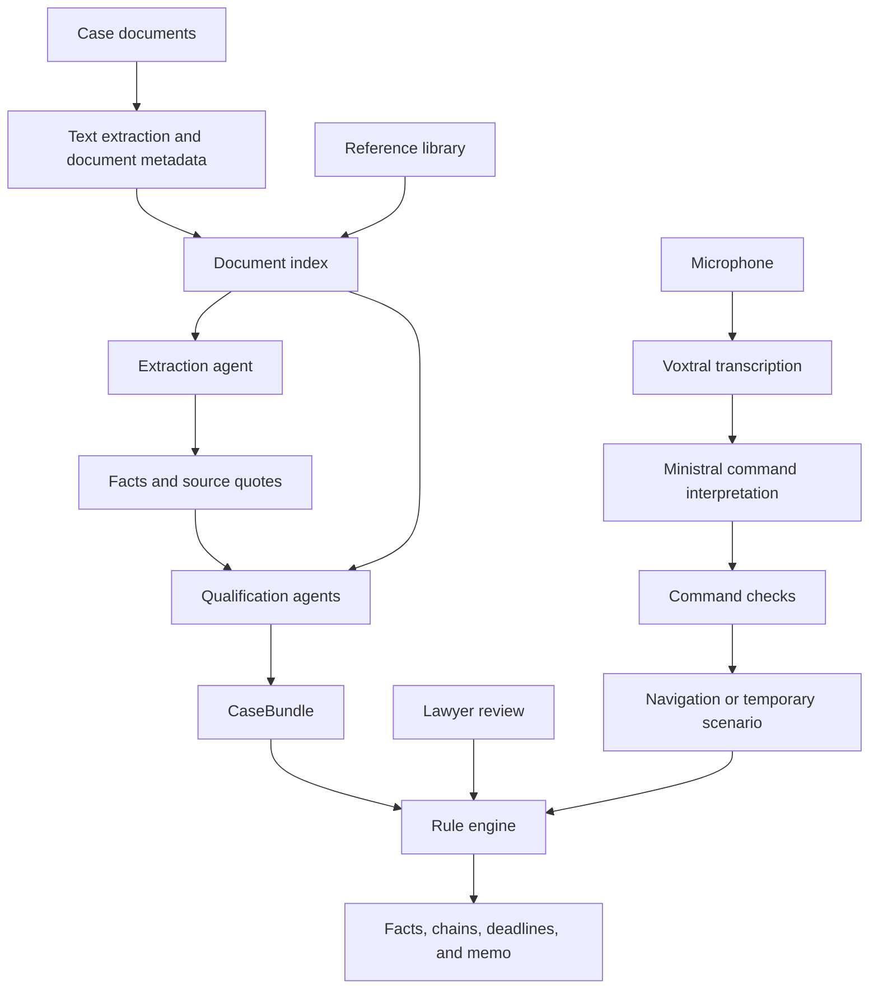

# Domino: Technical Architecture Questions and Answers

Prepared from the repository on 4 October 2026.

Hosting update: the public Cloudflare site now serves only the static frontend.
Hosted AI and voice are disabled.
The architecture answers describe the implemented local backend.

These answers use short sentences, active voice, and consistent technical terms.
They follow ASD-STE100 writing principles.
They are not a certified check of every word against the STE dictionary.
See the [official ASD-STE100 description](https://www.asd-ste100.org/about_STE.html).

## 1. Presentation script

> Domino helps a lawyer check French civil procedure.
> An extraction agent reads the case documents and records facts with source quotes.
> Qualification agents propose legal interpretations of selected facts.
> A rule engine checks consequence chains and calculates deadlines.
> The lawyer can adopt, edit, or disagree with an interpretation.
> Each review can change the chain result.
> For voice control, Voxtral converts speech to text.
> Ministral converts the text to a permitted command.
> The application checks the command before it changes the screen or a temporary scenario.

If the jury asks about models, add this statement:

> The current analysis configuration uses OpenAI models.
> The recorded sample also uses OpenAI.
> Mistral provides voice transcription and command interpretation.
> We also have a Mistral configuration for extraction and qualification.

## 2. Architecture

The pipeline code controls the order of work.
The rule engine runs in the browser for interactive review.
The server also uses the engine to check the analysis result.

## 3. Model reference

These names come from the code and configuration.
They do not prove which model a different server uses.
Check the local `/api/health` endpoint and the returned bundle before a live presentation.

| Task | Current OpenAI configuration | Optional Mistral configuration | Use |
| --- | --- | --- | --- |
| Fact extraction | `gpt-6.1-sol` | `ministral-14b-latest` | Read documents and record facts through tools. |
| Legal qualification | `gpt-6.1-sol` | `ministral-14b-latest` | Propose one interpretation for each selected question. |
| Document metadata | `gpt-6-luna` | `ministral-8b-latest` | Return the title, label, date, and document type as JSON. |
| Image transcription | `gpt-6.1-sol` | `pixtral-12b-latest` | Convert document images to text. |
| PDF transcription | `gpt-6.1-sol` | Current PDF path calls OpenAI. | Read PDF content through the provider. |
| Local semantic search | Separate embedding configuration | Default: `mistral-embed` | Convert text to vectors for search. |
| Continuous speech transcription | Not used | `voxtral-mini-transcribe-realtime-2602` | Convert an audio stream to text. |
| Voice command interpretation | Not used | `ministral-8b-latest` | Return a permitted command as JSON. |
| Earlier audio upload endpoint | Not used | `voxtral-mini-2602` | Transcribe a complete audio file. |

Local embeddings can use `text-embedding-3-small`.
The code can switch from Mistral embeddings to OpenAI embeddings when an OpenAI key is available.
Search can use keywords when embeddings fail.
The Cloudflare configuration uses keyword search without embeddings.

The recorded sample contains nine documents, ten facts, and five qualifications.
All ten facts have source matches.
Its usage record lists `gpt-6.1-sol`.
The sample does not prove a call to the metadata model or the image model.

## 4. Main questions

### Q1. What problem does Domino solve?

Domino helps a lawyer find procedural issues in a case file.
It connects a source fact to an interpretation, a rule, and a possible consequence.
The lawyer can inspect each link.

### Q2. What is your agent structure?

We use one extraction agent for each case.
Then we use one qualification agent for each selected legal question.
The pipeline code controls their order.
A rule engine uses their results to check the consequence chains.

### Q3. How many agents do you use?

The number depends on the verified facts.
The recorded sample has one extraction task and five qualification tasks.
The code allows three qualification tasks at once for OpenAI and two for Mistral.

### Q4. What does the extraction agent do?

It reads documents, finds procedural facts, and records the case profile.
Each fact contains a date, a role, a summary, and source quotes.
The server checks the quotes against the source text.

### Q5. What tools can the extraction agent use?

It can use six tools:

- `read_document` reads a document section.
- `search_documents` searches the case documents.
- `record_fact` adds a fact with source quotes.
- `update_fact` corrects a recorded fact.
- `set_case_profile` records the parties, court, and relationship.
- `finish` ends the extraction task.

These tools call application functions.
The agent does not receive a shell or a general code tool.

### Q6. What does a qualification agent do?

It answers one legal question about one verified fact.
It can read documents and search the case file or reference library.
It returns a proposed answer, reasons, confidence, and source quotes.
The current questions cover acknowledgment, conciliation, formal notice, and the outcome of a writ.

### Q7. How do the agents pass information?

The extraction stage returns structured facts and a case profile.
The qualification stage receives these results and access to the document index.
Each qualification task has its own model conversation.
The pipeline collects the results in a `CaseBundle`.

### Q8. Why use more than one agent task?

Extraction and legal interpretation need different instructions and tools.
Each qualification task answers a limited question.
This structure makes the intermediate results easier to inspect.
It also allows independent qualification tasks to run at the same time.

### Q9. Which models do you use?

The current default uses `gpt-6.1-sol` for extraction and qualification.
It uses `gpt-6-luna` for document metadata.
Voice uses Voxtral for transcription and `ministral-8b-latest` for commands.
The optional Mistral analysis configuration uses `ministral-14b-latest`.

### Q10. Why did you select these models?

We assign models to specific tasks.
Extraction and qualification need document reading and tool use.
Metadata needs a small structured answer.
Voice needs speech transcription and command interpretation.
We have not established that this selection is the best through a comparative benchmark.

### Q11. How do you call the models?

Our provider adapter sends requests to the model APIs.
The OpenAI path uses the Responses API.
The Mistral text path uses the chat completions API.
The adapter runs tool functions and returns their results to the model.
The loop stops when the task finishes or reaches its turn limit.

### Q12. Do you use an agent framework?

We use our own TypeScript pipeline and tool loop.
The core analysis path does not use LangChain or LangGraph.
The pipeline code controls the sequence, tools, and task limits.

### Q13. Does the model calculate legal deadlines?

The model extracts dates and proposes interpretations.
The rule engine calculates deadlines from those inputs.
For the same bundle and review state, the engine returns the same result.
An incorrect input or rule can still produce an incorrect result.

### Q14. How do you check the evidence?

The server finds each source quote in the document text.
It allows defined changes in spacing, case, and punctuation during the match.
It stores the matched source text for display.
A source match confirms that the text exists.
It does not prove that the interpretation is correct.

### Q15. What happens when a quote does not match?

The extraction tool asks the agent to correct the quote.
After a second failed attempt for the same fact key, it records the fact as unverified.
Qualification tasks use only verified facts.
The main chain engine also filters out unverified facts.

### Q16. How do you handle uncertainty?

Each qualification has a confidence label: high, medium, or low.
These labels come from the model instructions.
They are not measured probabilities.
The interface marks disputed interpretations for lawyer review.
The lawyer can adopt, edit, or disagree with an interpretation.

### Q17. How does a temporary scenario work?

The application changes an interpretation in temporary state.
The rule engine checks the chains again.
This step needs no new model call.
The temporary state does not replace the saved lawyer review.

### Q18. Does the model write the memo?

Application code builds the memo from the bundle, analysis, and review state.
The memo can include reasons that the qualification model supplied.
The core workflow does not use a separate model call to write the memo.

### Q19. How does voice control work?

The browser sends microphone audio through a server WebSocket bridge.
Voxtral returns transcript updates.
After a pause, Ministral converts the transcript to a JSON command.
The server and browser check the command against the selected case.
The application then applies a permitted action.

### Q20. Can a voice command approve a legal interpretation?

No.
Voice can navigate, explain an existing chain, preview a scenario, or reset a scenario.
It cannot approve or reject a legal interpretation.
Unknown case IDs and source IDs fail the command checks.
Voice control currently supports the built-in demo cases.

### Q21. Is the demo analysis live?

The default sample loads a recorded OpenAI result.
It makes no new analysis request.
With a local backend, fresh sample analysis and document uploads call the configured provider.
Local voice transcription and command interpretation use live Mistral calls.
The public Cloudflare site has no backend and cannot make these calls.
The interface reports a warning if fresh sample analysis falls back to the recorded result.

## 5. Follow-up questions

### Q22. Do you use retrieval-augmented generation?

Yes.
The agents can search case documents and a local reference library.
Local search can combine vector similarity with keyword scores.
The Cloudflare configuration uses BM25 keyword search to reduce external requests.
The agents can read the complete document after they find a useful result.

### Q23. What vector database do you use?

We do not use a separate vector database in the current core workflow.
The local index stores chunks and vectors in memory.
Local files can cache the vectors.
Each chunk contains up to 800 characters, with a 150-character overlap in long paragraphs.

### Q24. Do you train or fine-tune a model?

The repository has no model training or fine-tuning stage.
We use API models, task instructions, document search, and tools.
Changing a rule does not require model training.

### Q25. How do you control model output?

We define tool parameters and JSON output formats with schemas.
The tool handlers check source IDs, dates, quotes, and fact links.
The voice path also checks the action, target, value, and source IDs.
A schema controls the format.
It cannot establish legal correctness.

### Q26. How do you control time and cost?

Extraction allows up to 40 model turns.
Each qualification task allows up to 12 model turns.
The provider adapter limits the Mistral request rate and retries selected request failures.
The bundle records token usage for ingestion and agent calls.
Cached samples and engine updates avoid repeated analysis calls.
We have not established a complete cost figure for each case.

### Q27. What happens if a model request fails?

The main provider adapter retries rate-limit errors and server errors within a limit.
An extraction task must finish with a case profile and facts.
A qualification task that returns no answer creates a marked fallback with low confidence.
Live voice failures return an error.
The user can continue with the manual controls.

### Q28. Where do you keep the data and API keys?

The browser calls our backend.
The backend keeps the provider keys in its environment or Cloudflare Secrets.
Fresh analysis sends relevant documents or text to the selected provider.
Voice sends audio and command context to Mistral.
Local analysis can save case bundles and embedding caches on disk.
Worker analysis disables the case bundle cache and uses request-scoped temporary storage.

### Q29. How do you test the system?

The repository contains tests for source matches, agents, provider adapters, and the rule engine.
Voice tests check permitted actions and review state isolation.
The evaluation script checks expected facts, dates, qualifications, and chain results on the sample.
These checks do not establish accuracy across all French litigation cases.
Quote the latest test report only after you verify that report.

### Q30. What are the main limits?

The current system covers selected procedural chains.
The extra demo cases use synthetic fixtures.
The fresh qualification stage has a limited set of question types.
The reference library contains real court decisions and marked mock sources.
It does not search a complete live legal database.
Legal review and broader evaluation remain necessary.

### Q31. How would you add a new legal issue?

We would define the required fact roles and qualification questions.
Then we would add the consequence chain and its deadline rules.
We would add sources, expected examples, and tests.
A lawyer would review the rules and examples before use.

### Q32. Can a law firm connect its own system?

The repository includes a local integration API and a SQLite demonstration.
The API can import normalized case data and return analysis results.
An optional AI review adds limited comments to the existing analysis.
That review does not run the full extraction pipeline.
The Cloudflare Worker does not expose these local integration routes.

### Q33. Can we switch every task to Mistral today?

We can select Mistral for text extraction and qualification.
That configuration also uses Mistral for document metadata and image transcription.
The current PDF path still calls OpenAI and requires an OpenAI key.
Local embeddings can also switch providers after a request failure.
A complete Mistral-only path needs further work and verification.

### Q34. What makes the architecture useful for legal work?

The system keeps facts, interpretations, rules, and lawyer decisions as separate data.
The user can inspect the source behind a fact.
A changed interpretation produces a visible change in the consequence chain.
This structure helps the lawyer locate the point that needs review.

## 6. Presentation checks

Use these statements only when the code or a verified report supports them:

| Avoid this claim | Use this answer |
| --- | --- |
| “Everything uses Mistral.” | “Mistral provides voice. The current default analysis uses OpenAI.” |
| “The sample analysis is live.” | “The default sample is recorded. Fresh analysis calls the provider.” |
| “Five permanent agents debate the case.” | “One extraction task creates facts. Separate qualification tasks answer selected questions.” |
| “The model proves the legal result.” | “The model proposes interpretations. The engine checks encoded rules.” |
| “Every source match proves the fact.” | “A source match proves that the quoted text exists.” |
| “The memo comes from another agent.” | “Application code builds the memo from the analysis and review state.” |
| “All search uses embeddings.” | “Local search can use embeddings. The Worker configuration uses keywords.” |
| “All client data stays on our server.” | “Fresh analysis and voice send data to the relevant provider.” |
| “We have proved high legal accuracy.” | “We have targeted tests and a sample evaluation script.” |
| “The public site includes the firm connector.” | “The firm connector is a local integration demonstration.” |

## 7. Code evidence

| Topic | Repository source |
| --- | --- |
| Pipeline order and bundle | `web/server/pipeline.ts` |
| Default model sets | `web/server/config.ts` |
| Cloudflare provider and search settings | `web/wrangler.jsonc` |
| Recorded model and sample counts | `data/sample-case/ai-bundle.json` |
| Default sample and explicit fallback | `web/src/components/StartScreen.tsx` |
| Extraction tools and turn limit | `web/server/agents/extract.ts` |
| Qualification tools, concurrency, and fallback | `web/server/agents/qualify.ts` |
| Model instructions | `web/server/agents/prompts.ts` |
| API adapter, retries, and embedding fallback | `web/server/providers.ts` |
| Text, image, and PDF paths | `web/server/ingest.ts` |
| Chunking and search | `web/server/retrieval.ts` |
| Quote matching | `web/server/anchor.ts` |
| Chains, reviews, and scenarios | `web/src/engine/chains.ts` |
| Deadline calculations | `web/src/engine/limitation.ts`, `web/src/engine/proceduralDates.ts` |
| Memo generation | `web/src/engine/memo.ts` |
| Live voice model | `web/server/realtime-bridge.ts` |
| Voice command model and output schema | `web/server/voice-api.ts` |
| Voice checks | `web/src/voice/contract.ts`, `web/src/voice/commands.ts` |
| Worker routes and storage settings | `web/server/worker.ts` |
| Sample evaluation | `web/scripts/eval.ts` |
| Local firm integration scope | `docs/LAW_FIRM_INTEGRATION.md` |
